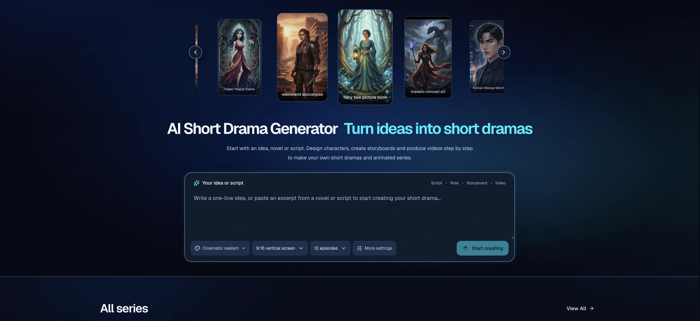
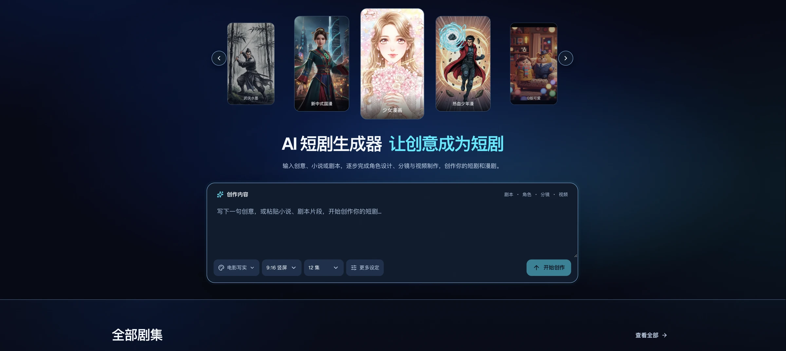
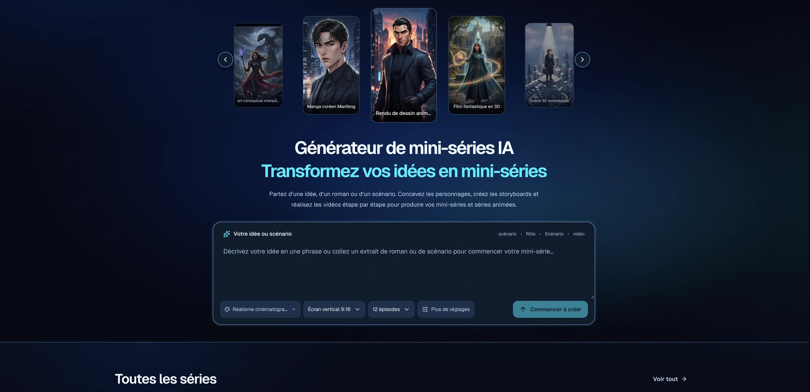
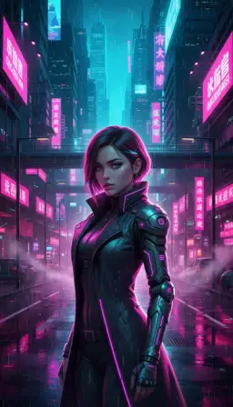

**Choose your language / 选择文档语言 / Choisir la langue**

| English | 简体中文 | Français |
| :---: | :---: | :---: |
| **[Read the English documentation](README.md)** | **[阅读完整中文文档](README.zh-CN.md)** | **Documentation française** |

<div align="center">

<a href="https://makivue.com?utm_source=github">
  
</a>

# makivue

**Transformez une idée en mini-série avec l’IA.**

Scénarios · Personnages · Décors · Storyboards · Vidéos · Sous-titres

Un atelier local de création de mini-séries, développé avec Next.js, React et TypeScript.

[Site officiel](https://makivue.com?utm_source=github) · [Démarrage rapide](#quick-start) · [Configuration des modèles](MODEL_CONFIG.md) · [Contribuer](CONTRIBUTING.md)

**Rejoignez la communauté :** [WhatsApp](https://chat.whatsapp.com/LGcDrlKUrZ3AbJdO8WSPox?mode=gi_t) · [Telegram](https://t.me/+piA50HGZMaAxNTU1)

</div>

---

makivue réunit l’écriture, la gestion des ressources et la production vidéo dans un même projet. Partez d’une idée ou importez votre roman ou scénario, puis préparez les personnages, les plans et le montage de chaque épisode.

**Vos projets et vos médias restent sur votre ordinateur. Les modèles utilisent vos propres comptes fournisseurs.** L’édition locale ne nécessite ni connexion à un compte en ligne, ni service de base de données, ni stockage cloud. Le serveur local envoie les demandes de génération directement au fournisseur choisi.

## Édition de génération de base

Cette édition conserve le parcours de création complet et vous laisse vérifier les résultats :

- **Personnages :** une image de référence en pied par génération, avec sélection des propositions et relance manuelle.
- **Storyboard :** un premier brouillon tiré du scénario ; les textes longs sont traités par lots. Les actions, dialogues et durées se modifient manuellement.
- **Illustrations :** une consigne simple et les références des personnages sélectionnés, sans réécriture automatique ni correction de continuité entre les plans.
- **Vidéos :** chaque plan utilise le modèle choisi, sans recommandation automatique, comparaison de modèles ou assemblage de plusieurs segments générés.
- **Vérification :** à effectuer vous-même. Aucun score de qualité par IA, contrôle visuel, relecture narrative ou nouvelle génération déclenchée par un contrôle qualité.

La génération par lots, l’annulation, la reprise des tâches, les relances manuelles, la validation des entrées et la protection des modifications récentes restent disponibles. Les exigences de format et de sécurité des fournisseurs s’appliquent toujours. Les images de début et de fin restent utilisables lorsque le modèle les prend en charge nativement.

## Aperçu de l’interface

### English



### 简体中文



### Français



## Fonctionnalités

| Fonction              | Possibilités                                                                                                             |
| --------------------- | ------------------------------------------------------------------------------------------------------------------------ |
| Histoire et scénario  | Créer un plan narratif et des scénarios par épisode, ou importer des fichiers TXT, Markdown, DOCX et PDF                 |
| Personnages et décors | Extraire les personnages et les lieux, gérer leurs images de référence et réutiliser les ressources                      |
| Storyboard            | Modifier les descriptions des plans, les actions, les dialogues, les mouvements de caméra, la durée et les images clés   |
| Images                | Générer des personnages, des décors et des illustrations de plans, ou utiliser l’espace de création d’images indépendant |
| Vidéo                 | Générer à partir de texte, d’images ou de références, avec du son natif lorsque le modèle le permet                      |
| Montage et export     | Assembler les plans et les épisodes avec FFmpeg en local, gérer les sous-titres et télécharger le résultat               |
| Vidéo de référence    | Analyser des images extraites d’une vidéo, générer un clip similaire ou sélectionner des moments forts                   |
| Espace local          | Conserver les projets, l’avancement des tâches, les relevés d’utilisation des modèles et les médias générés              |
| Langues               | Anglais, chinois, français, arabe, indonésien, hindi, filipino, japonais et coréen                                       |

Les résolutions, les durées, les formats de référence et les possibilités audio dépendent du modèle et des droits de votre compte fournisseur.

### Aperçus de styles inclus

Le dépôt contient **278 aperçus de styles**, accompagnés de leurs miniatures. Les exemples ci-dessous sont des fichiers locaux : aucune clé de modèle ni aucun service d’images distant n’est nécessaire pour les afficher.

|                                          Peinture à l’encre                                          |                                         Cyberpunk                                         |                                         Animation en pâte à modeler                                          |                                             Diorama miniature                                             |
| :--------------------------------------------------------------------------------------------------: | :---------------------------------------------------------------------------------------: | :----------------------------------------------------------------------------------------------------------: | :-------------------------------------------------------------------------------------------------------: |
|  |  |  |  |

<a id="quick-start"></a>

## Démarrage rapide

### 1. Préparer l’environnement

- Node.js 22.12+ dans la branche 22 LTS, ou Node.js 24+, avec npm.
- FFmpeg et ffprobe installés et disponibles dans le `PATH`.
- Vos propres identifiants pour les fournisseurs de modèles que vous souhaitez utiliser.

Sur macOS, vous pouvez installer FFmpeg avec `brew install ffmpeg`. Sous Windows ou Linux, installez FFmpeg séparément ou utilisez Docker comme indiqué plus bas.

Vérifiez les commandes suivantes :

```bash
node --version
npm --version
ffmpeg -version
ffprobe -version
```

### 2. Installer le projet

Clonez le dépôt :

```bash
git clone https://github.com/makivue/makivue.git
cd makivue
```

Vous pouvez aussi choisir **Code → Download ZIP**, extraire l’archive et ouvrir le dossier du projet. Installez ensuite les dépendances et préparez votre configuration :

```bash
npm ci
cp .env.example .env
```

Dans PowerShell sous Windows, utilisez `Copy-Item .env.example .env`.

Modifiez `.env` et renseignez **vos propres** clés ou jetons pour les fournisseurs utilisés. Le projet ne fournit aucun identifiant partagé. Les fournisseurs inutilisés peuvent rester non configurés.

### 3. Démarrer l’espace local

```bash
npm run dev
```

Ouvrez [http://localhost:3000](http://localhost:3000).

Vous pouvez créer et modifier des projets ou lire des documents sans vous connecter ni acheter de crédits. L’analyse et la génération par IA nécessitent les identifiants du fournisseur concerné. Choisissez un modèle configuré dans les paramètres avant de lancer une génération.

### 4. Vérifier la configuration ou utiliser une version compilée

```bash
npm run models:check
npm run build
npm start
```

La vérification contrôle la présence de la configuration, sans contacter les fournisseurs ni afficher les clés. Elle ne vérifie pas les droits d’accès de votre compte aux modèles. Redémarrez le serveur après toute modification des identifiants.

## De l’histoire à la vidéo

1. **Créer un projet** à partir d’une idée ou de votre propre scénario.
2. **Relire le scénario** : plan narratif, structure des épisodes, personnages et dialogues.
3. **Préparer les ressources** : choisir un style, puis générer ou importer les références des personnages et des décors.
4. **Éditer les plans** : descriptions, actions, caméra, durée et images clés.
5. **Générer les images et les vidéos**, avec la possibilité de relancer un plan individuellement.
6. **Assembler et exporter** : vérifier l’ordre des plans et les sous-titres, puis réaliser le montage en local.

Commencez par un projet court pour vérifier l’accès aux modèles et la qualité des résultats avant de lancer des traitements par lots.

## Modèles et identifiants personnels

| Fournisseur                      | Utilisation principale                               | Votre configuration                                                          |
| -------------------------------- | ---------------------------------------------------- | ---------------------------------------------------------------------------- |
| OpenAI ou fournisseur compatible | Texte et analyse d’images extraites d’une vidéo      | `OPENAI_API_KEY` ; ajoutez `OPENAI_BASE_URL` pour un fournisseur compatible  |
| Azure OpenAI                     | Texte                                                | `AZURE_OPENAI_TEXT_API_KEY` et `AZURE_OPENAI_TEXT_ENDPOINT`                  |
| Google Vertex AI                 | Texte Gemini, images Nano Banana et vidéos Veo       | Votre fichier de compte de service ou `NANO_BANANA_SERVICE_ACCOUNT_JSON_B64` |
| Alibaba DashScope                | Images Qwen et vidéos Wan                            | `DASHSCOPE_API_KEY`                                                          |
| Volcengine Ark                   | Vidéos Seedance                                      | `SEEDANCE_API_KEY` et les identifiants de modèles accessibles à votre compte |
| HiModels, facultatif             | Modèles de texte, d’image et de vidéo pris en charge | `HIMODELS_API_KEY`                                                           |

Conservez les identifiants dans le fichier `.env` ignoré par Git, dans les variables d’environnement du processus ou dans un fichier de configuration externe au dépôt. Les paramètres de l’interface enregistrent les préférences de génération, jamais les clés. Les clés de fournisseurs différents ne sont pas interchangeables.

Les frais sont facturés directement à votre compte par le fournisseur. Les instructions et les références nécessaires lui sont transmises ; les médias générés sont ensuite enregistrés localement. Le stockage local des projets ne rend donc pas la génération entièrement hors ligne.

Le [guide détaillé de configuration](MODEL_CONFIG.md), actuellement en chinois, décrit les variables, les comptes de service Google, les identifiants de modèles Ark et le montage des fichiers d’identifiants dans Docker.

## Stockage et sauvegardes

Les données sont enregistrées par défaut dans `data/`, à la racine du projet. Utilisez `LOCAL_DATA_DIR` pour choisir un autre emplacement.

```text
data/
├── workspace.json    # Projets, préférences, tâches et utilisation des modèles
└── media/            # Images, vidéos, audio et sous-titres
```

- Les enregistrements utilisent un verrouillage de fichiers et des écritures atomiques. Les médias locaux sont servis par `/api/local-media/...`.
- Les aperçus inclus se trouvent dans `public/style-previews/`. Les références propres à chaque projet sont conservées dans le dossier de données.
- `public/storage/` et le dossier temporaire du système servent au traitement des médias ; ne les ajoutez pas à Git.
- Arrêtez l’application avant de copier l’intégralité du dossier de données pour une sauvegarde ou une restauration. Vérifiez ensuite la valeur de `LOCAL_DATA_DIR`.
- Conservez les identifiants séparément, en dehors des dépôts publics et des sauvegardes partagées.

L’édition locale utilise des fichiers JSON, sans serveur MySQL, SQLite ou autre moteur de base de données. Le schéma Prisma conservé décrit les enregistrements et génère les types TypeScript ; aucune migration de base de données n’est nécessaire.

Cet espace est conçu pour un seul utilisateur local. Le démarrage direct et le mode développement écoutent par défaut sur l’interface de boucle locale.

## Exécution avec Docker

L’image contient Node.js et FFmpeg. Préparez votre propre fichier `.env`, puis exécutez :

```bash
docker build -t makivue .
docker run --rm --name makivue \
  -p 127.0.0.1:3000:3000 \
  --env-file .env \
  -e LOCAL_DATA_DIR=/app/data \
  -v "$PWD/data:/app/data" \
  makivue
```

Ouvrez [http://localhost:3000](http://localhost:3000). Le volume conserve les projets et les médias ; les identifiants et les données personnelles sont exclus de l’image. La syntaxe des commandes ci-dessus convient à Bash et Zsh ; adaptez-la pour PowerShell.

Un fichier d’identifiants Google externe doit être monté séparément, avec une variable pointant vers son **chemin dans le conteneur**. Voir l’[exemple de montage](MODEL_CONFIG.md#docker-credentials). Cette configuration permet un accès local ; elle n’est pas destinée à un service public multi-utilisateur.

## Développement

Le projet utilise Next.js 16, React 19, TypeScript, Tailwind CSS 4, des fichiers JSON, FFmpeg, ffprobe et Sharp.

```text
src/app/                 Pages et routes du service local
src/components/          Interface de création et composants partagés
src/services/            Adaptateurs de modèles, médias et génération
src/lib/                 Stockage local, tâches et utilitaires
src/i18n/                Traductions de l’interface
public/style-previews/   Aperçus et miniatures inclus
docs/screenshots/        Captures de l’interface pour la documentation
scripts/                 Développement, vérifications et maintenance
prisma/                  Schéma des enregistrements et migrations inactives
```

```bash
npm run build
npm run lint
npm run typecheck
npm test
```

La compilation vérifie d’abord l’absence d’informations sensibles dans les fichiers à publier, puis génère les types. Les tests de modèles utilisent des réponses simulées et ne nécessitent pas de véritables clés. Les tests d’intégration des médias nécessitent FFmpeg. Le [guide de contribution](CONTRIBUTING.md) est actuellement en chinois.

## Questions fréquentes

### Faut-il acheter des crédits ou créer un compte sur le site officiel ?

Non. L’édition locale utilise vos propres comptes fournisseurs. Le [site officiel](https://makivue.com?utm_source=github) est une destination distincte ; il ne sert pas de backend métier à l’espace local.

### Où renseigner les clés API ?

Dans votre fichier `.env` local, puis redémarrez le serveur. L’interface enregistre uniquement les préférences de génération. Configurez seulement les fournisseurs que vous utilisez.

### FFmpeg ou ffprobe est introuvable ?

Vérifiez que les deux commandes sont dans le `PATH`, ou définissez `FFMPEG_PATH` et `FFPROBE_PATH`. Elles sont incluses dans l’image Docker.

### Pourquoi l’importation d’un document échoue-t-elle ?

Les formats acceptés sont TXT, Markdown, DOCX et PDF, avec une limite de 8 Mio et de 200 000 caractères extraits. Les PDF numérisés nécessitent une reconnaissance de caractères préalable. Convertissez les anciens fichiers `.doc` au format `.docx`.

### L’analyse d’une vidéo de référence transcrit-elle l’audio ?

Elle analyse huit images extraites de la vidéo, sans transcrire la piste audio. La génération d’une vidéo similaire produit un clip issu du modèle ; la sélection des moments forts utilise FFmpeg en local.

### Comment mettre à jour le projet ?

Arrêtez le service et sauvegardez vos données. Dans votre clone, exécutez `git pull --ff-only`, puis `npm ci`. Relancez le mode développement, ou compilez avec `npm run build` avant `npm start`. Conservez votre `.env` et votre dossier de données, et résolvez les éventuels conflits de code avant de redémarrer.

## Contributions et licence

Les signalements de problèmes, les améliorations de documentation et les contributions de code sont les bienvenus. Fournissez les étapes de reproduction, votre environnement et des messages d’erreur sans informations sensibles. Consultez le [guide de contribution](CONTRIBUTING.md).

Le projet est distribué sous [licence MIT](LICENSE), qui autorise l’utilisation, la modification, la distribution et l’usage commercial. Conservez la mention de copyright et la licence lors de la distribution du code. Les résultats des modèles et les ressources de référence restent soumis aux conditions des fournisseurs et des ayants droit concernés.

L’organisation de la documentation s’inspire de [Huobao Drama](https://github.com/chatfire-AI/huobao-drama). Les fonctionnalités et les instructions décrivent les possibilités de ce dépôt.

---

**Language / 语言 / Langue :** [English — Read the English documentation](README.md) · [简体中文 — 阅读完整中文文档](README.zh-CN.md) · **Français**
